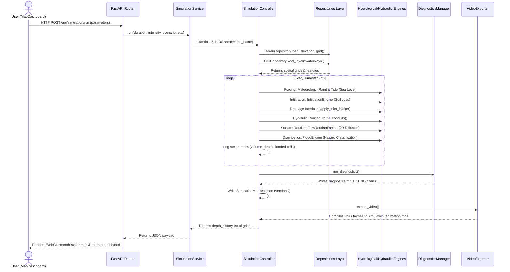

# Architecture Execution Trace — Mumbai Flood Digital Twin

This document details the complete end-to-end execution order and coupling flow of the Version 1.0 Beta simulation.

---

## 1. Sequence Diagram

---

## 2. Step-by-Step Execution Lifecycle

### Step 1: User Action (Frontend UI)
The user selects simulation duration, rainfall intensity, and rainfall mode (e.g. constant, alternating block, or historical replay scenario) on the [MapDashboard](file:///c:/Users/Hitesh/Desktop/mumbai-flood-digital-twin/frontend/src/components/MapDashboard.tsx) sidebar, and clicks **Run Flood Simulation**.

### Step 2: API Request (FastAPI)
The frontend sends an HTTP POST request to `/api/simulation/run` with the parameter schema. The FastAPI router inside [`backend/api/simulation.py`](file:///c:/Users/Hitesh/Desktop/mumbai-flood-digital-twin/backend/api/simulation.py) validates the request.

### Step 3: Simulation Service Coordination
The router invokes [`backend/services/simulation_service.py`](file:///c:/Users/Hitesh/Desktop/mumbai-flood-digital-twin/backend/services/simulation_service.py) which handles high-level execution management, starting the simulation timer.

### Step 4: Repository Ingestion (Task 1)
Instead of accessing the filesystem directly, [`SimulationController`](file:///c:/Users/Hitesh/Desktop/mumbai-flood-digital-twin/simulation/core/controller.py) calls the data repositories:
- [`TerrainRepository`](file:///c:/Users/Hitesh/Desktop/mumbai-flood-digital-twin/backend/data/terrain_repo.py) to read the georeferenced Copernicus DEM GeoTIFF.
- [`GISRepository`](file:///c:/Users/Hitesh/Desktop/mumbai-flood-digital-twin/backend/data/gis_repo.py) to load the OSM waterways, roads, and building layers.
- [`ScenarioRepository`](file:///c:/Users/Hitesh/Desktop/mumbai-flood-digital-twin/backend/data/scenario_repo.py) to load scenario configurations and rainfall profiles.

### Step 5: Grid Configuration
The controller passes the pre-loaded data to `GridManager` to map the cell matrix, set elevations, and calculate cell dimensions.

### Step 6: Simulation Step Lifecycle (Hydrology & Hydraulics)
At every step (dt = 15 minutes), the controller coordinates the following sequence:
1. **Forcing**: The meteorology engine generates the rain rate grid. The tide engine computes the boundary sea level.
2. **Infiltration**: Soil infiltration losses are calculated and subtracted from the surface grid.
3. **Drainage Interface**: Surface grid cells are mapped to inlets, and water is captured up to the grates capacity, draining the surface.
4. **Hydraulic Routing**: The captured intake rate is injected as junctions inflows, and convective kinematic wave routing moves water through pipes and nullahs.
5. **Surface Routing**: The 2D diffusion-wave routing solver uses slope and aspect gradients to distribute water overland to surrounding cells.
6. **Diagnostics**: Flooded areas, velocity grids, and hazard classes (transparent, sky blue, amber, orange, crimson) are updated.

### Step 7: Automated Diagnostics (Task 5)
Upon simulation completion, [`DiagnosticsManager`](file:///c:/Users/Hitesh/Desktop/mumbai-flood-digital-twin/simulation/diagnostics/manager.py) computes stats, NSE/KGE validation scores, and automatically saves:
- `water_depth_histogram.png`
- `hydrograph.png`
- `mass_balance.png`
- `flooded_area_vs_time.png`
- `outfall_discharge.png`
- `drainage_capacity.png`
- `profiler.json`
- `diagnostics.md`

### Step 8: Simulation Manifest Version 2 (Task 6)
The controller compiles execution metadata, environment properties (OS, Python packages, package checksums), and writes the Version 2 `SimulationManifest.json` to the output folder.

### Step 9: Video Animation (Task 3)
The [`VideoExporter`](file:///c:/Users/Hitesh/Desktop/mumbai-flood-digital-twin/visualization/video_exporter.py) reads the PNG frames generated during execution and compiles them into `simulation_animation.mp4` for validation replays.

### Step 10: Renders WebGL Overlays (Frontend)
The API returns the depth history time-series to the frontend. The dashboard renders water depth and terrain overlays smoothly using canvas/raster sources and WebGL linear resampling, completely removing square pixel checkerboarding.
