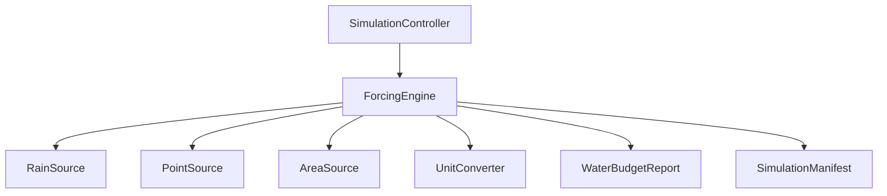

# Forcing Engine — Architectural Specifications & Guidelines

This document details the architecture, public APIs, unit conversions, and mass conservation strategies for the Mumbai Flood Digital twin Forcing Framework (Sprint 4).

---

## 1. Architecture & Design Principles

The Forcing Framework is built to ingest external water inputs (forces) into the simulation grid. Its design decouples the representation of water sources from the routing engine, ensuring that adding new forcing types in future sprints does not require rewriting the simulation loop.

Key principles:
* **No In-Place Mutation**: The `ForcingEngine` receives `SimulationState(n)` and returns a cloned `SimulationState(n+1)` containing the water additions.
* **Extensibility**: All source inputs inherit from a common `ForcingSource` base class. Adding lines, rivers, or tidal sources in future sprints only requires implementing the `get_water_input` interface.
* **Centralized Conversions**: All physical conversions are isolated in `UnitConverter` to prevent calculation offsets across the codebase.

---

## 2. Public API Specification

### `ForcingEngine`
Coordinates active forcing sources and tracks the cumulative water budget.

* `__init__(dx_m: float, simulation_uuid: str)`: Initializes the framework for a grid cell size `dx_m`.
* `register_source(source: ForcingSource) -> None`: Registers a forcing source.
* `remove_source(source_id: str) -> None`: De-registers a source by ID.
* `enable_source(source_id: str, enabled: bool = True) -> None`: Enables or disables a source.
* `advance(state: SimulationState, dt: float) -> Tuple[SimulationState, WaterBudgetReport]`: Advances the active sources by `dt` seconds, injects water, and returns the updated state copy and budget report.
* `finish() -> None`: Finalizes the run and logs the simulation completion event.

### `ForcingSource` subclass interfaces:
* `RainSource(source_id: str, intensity_mm_hr: float)`: Spatially uniform rainfall.
* `PointSource(source_id: str, discharge_m3_s: float, row: int, col: int)`: Localized point discharge.
* `AreaSource(source_id: str, rate: float, mask: np.ndarray, is_intensity: bool = True)`: Uniform input over a spatial patch.

---

## 3. Unit Conversion Strategy

To maintain mathematical consistency, the `UnitConverter` class is the sole authority for physical transformations:

| Operation | Input Unit | Output Unit | Conversion Formula |
|---|---|---|---|
| `mm_hr_to_m_s` | mm/hr | m/s | `val / 3,600,000` |
| `m_s_to_mm_hr` | m/s | mm/hr | `val * 3,600,000` |
| `mm_to_m` | mm | m | `val / 1000` |
| `m_to_mm` | m | mm | `val * 1000` |
| `depth_to_volume` | m | m³ | `depth * area` |
| `volume_to_depth` | m³ | m | `volume / area` |
| `cell_depth_to_volume` | m | m³ | `depth * (dx * dx)` |
| `cell_volume_to_depth` | m³ | m | `volume / (dx * dx)` |

All methods support vectorized operations on NumPy arrays.

---

## 4. Mass Conservation Strategy

Mass conservation is verified at every timestep through the `WaterBudgetReport` dataclass:

$$ \text{Residual Error} = \text{Current Storage} - (\text{Initial Water} + \text{Water Added} - \text{Boundary Loss}) $$

$$ \text{Relative Error} = \frac{\text{Residual Error}}{\text{Initial Water} + \text{Water Added}} $$

Since the forcing framework only adds water and does not compute horizontal routing, `Boundary Loss` is always `0.0`. The relative error is verified in test suites to be bounded within `1e-5` (machine epsilon of single-precision `float32`).

---

## 5. Benchmark Methodology

We validate the engine against four analytical scenarios on a 10x10 grid with 10m cell size:
1. **uniform_rain**: Uniform rainfall of 50 mm/hr for 1 hour. Confirms depth increment is exactly 0.05m and volume is $5,000\text{ m}^3$.
2. **point_source**: 2.5 m³/s point source at cell (5,5) for 10 seconds. Confirms volume is $25\text{ m}^3$ and cell depth is 0.25m.
3. **area_source**: 10 m³/s uniform area source over 4x4 center patch for 20 seconds. Confirms volume is $200\text{ m}^3$ and patch depth is 0.125m.
4. **multiple_sources**: Combines rain, point, and area sources simultaneously. Confirms that cumulative water addition matches the sum of individual source expectations.

---

## 6. Known Limitations & Future Extensions

### Limitations
* **Fixed Source Coordinates**: Point sources cannot currently change location dynamically during a run.
* **No Spatial Interpolation**: Rainfall is assumed uniform or pre-masked; no inverse distance weighting (IDW) or kriging interpolation is performed at this stage.

### Future Extensions (Sprint 5)
* Integration of spatially varying rainfall maps.
* Support for tide/sea level forcing at coast boundaries.
* Dynamic discharge rate updates (timeseries hydrographs).
